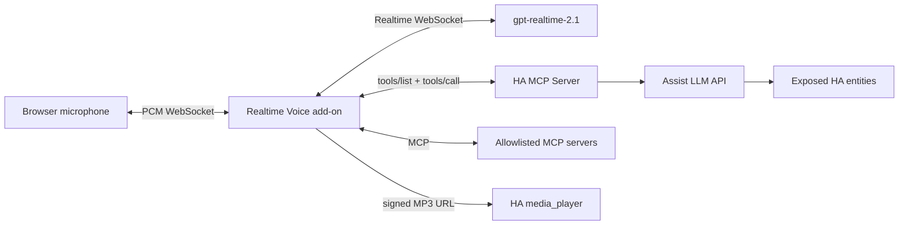
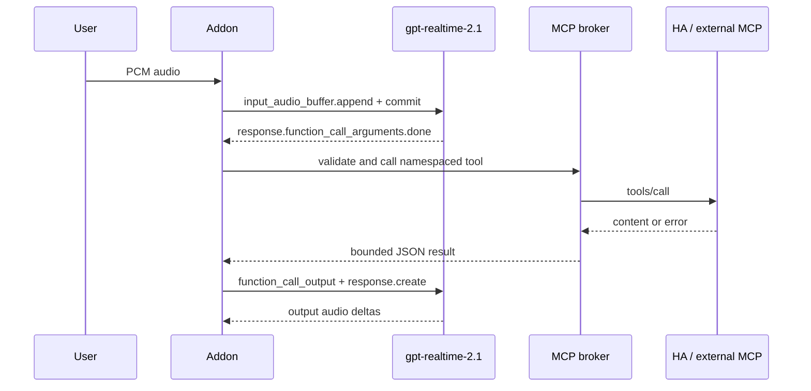

# Architecture

## Runtime topology

Home Assistant and configured external MCP servers are clients of the add-on's MCP
broker. The broker namespaces every tool and presents the resulting JSON Schemas to
OpenAI as Realtime function tools. OpenAI never receives the MCP endpoint or its
credentials.

## Discovery

1. The add-on connects to HA's `/api/mcp/assist` with `SUPERVISOR_TOKEN`.
2. It initializes each explicitly configured remote MCP connection.
3. It runs `tools/list`, filters external tools through `allowed_tools`, and namespaces
   names as `mcp_<server>_<tool>`.
4. Each new Realtime session receives the current tool catalog in `session.update`.

## Invocation

The OpenAI `call_id` is retained until the function result is returned. Tool output is
capped at 16 KiB and failures are represented as JSON so the model can explain them.

## Speaker output

Browser routes receive PCM directly. Generic HA speakers receive signed HTTP MP3 URLs:

- Buffered mode encodes after the whole reply and is the compatibility default.
- Progressive mode feeds an MP3 encoder during generation and exposes a chunked stream.
- URLs contain 256-bit random tokens, expire after five minutes, and are never cached.
- Physical speakers need LAN access to the configured `speaker_base_url` on port 8099.

## Trust boundaries

| Boundary | Credential |
|---|---|
| Browser to add-on | Home Assistant ingress session |
| Add-on to OpenAI | Add-on-owned OpenAI API key |
| Add-on to HA | Supervisor token |
| Add-on to external MCP | Per-server bearer/custom headers |
| Speaker to add-on | Short-lived opaque media token |

There is no per-call confirmation. HA entity exposure and external MCP allowlists are
therefore mandatory policy boundaries.
